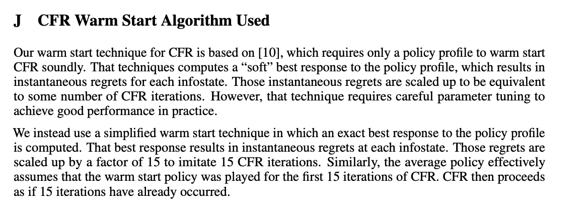

# Strategy-Based Warm Starting
Python replication of "Strategy-Based Warm Starting for Regret Minimization in Games", Noam Brown &amp; Tuomas Sandholm 2016

paper: https://www.cs.cmu.edu/~noamb/papers/16-AAAI-Strategy-Based-TR.pdf

# Result

Figure 1 from the paper (random 100x100 matrix games, warm-starting cumulative regrets each iteration from the average policy):


Also tried doing the same experiment as Figure 1, but with RM+. RM+ improves the results without warm-starting, but not with warm-starting? Maybe I did something wrong:


# Notes on the paper

I think there are some typos in the paper: 

In the section "Warm-starting Algorithm", in the middle of left column, page 4, I'm guessing

Define $\upsilon'^\sigma_i(z)$ for $z \in Z$ as $\pi^\sigma_{-i}u_i(z)$.

should be 

Define $\upsilon'^\sigma_i(z)$ for $z \in Z$ as $\pi^\sigma_{-i}(z)u_i(z).$

Similarly, near the end of the section "Choosing Substitute Counterfactual Values", I think 

In particular, $\pi^\sigma_{-i}(\Delta(I))^2$ in (16) acts as a bound on ...

should be

In particular, $\pi^\sigma_{-i}(I)(\Delta(I))^2$ in (16) acts as a bound on...

# Literature Review

This paper is from 2015/2016. I was curious to see what had been done in the 6 years between then and now (2022).

The paper has been cited 20 times according to [Google Scholar](https://scholar.google.com/scholar?cites=9026537006894341136&as_sdt=10000005&sciodt=0,20&hl=en). I went through most of them and logged anything notable here so you don't have to.

#### warm-starting in ReBeL

The most interesting usage was that warm-starting was used in [ReBeL](https://proceedings.neurips.cc/paper/2020/hash/c61f571dbd2fb949d3fe5ae1608dd48b-Abstract.html) experiments (also by Noam Brown et al). In [the appendix](https://proceedings.neurips.cc/paper/2020/file/c61f571dbd2fb949d3fe5ae1608dd48b-Supplemental.pdf), they state that they used a simpler method based on computing the *exact* best-response instead of the "soft" best-response (where $\upsilon'^\sigma_1+\upsilon'^\sigma_2 \leq 0$):


It's not clear why this choice was made.

#### others

In ["Model-Free Neural Counterfactual Regret Minimization with Bootstrap Learning"](https://arxiv.org/pdf/2012.01870.pdf), the method of warm-starting on each iteration is used as the basis for neural CFR, since this method obviates the need to keep cumulative regrets. I think the idea is: unlike Deep CFR (which needs to approximate avg policy AND cumulative regrets), you only need to approximate avg policy.

Mentioned in ["Regret Circuits: Composability of Regret Minimizers"](http://proceedings.mlr.press/v97/farina19b/farina19b.pdf), Farina, Kroer, Sandholm, 2019.

#### not used

Mostly, warm-starting was cited in papers to mention that it could have been used, but wasn't. Example: ["Player of Games", Schmid et al (Deepmind), 2021](https://arxiv.org/pdf/2112.03178.pdf) "And while possible [9], there is no warm-starting in the current implementation of PoG." and likewise in [Libratus, 2017](https://www.cs.cmu.edu/~noamb/papers/17-IJCAI-Libratus.pdf).

It is notably mentioned as a promising future work in ["Monte Carlo Continual Resolving for Online Strategy Computation in Imperfect Information Games"](https://arxiv.org/pdf/1812.07351.pdf), Michal Šustr, Vojtěch Kovařík, and Viliam Lisý, 2019.

# Citation

```bibtex
@inproceedings{brown2016strategy,
  title={Strategy-based warm starting for regret minimization in games},
  author={Brown, Noam and Sandholm, Tuomas},
  booktitle={Proceedings of the AAAI Conference on Artificial Intelligence},
  volume={30},
  number={1},
  year={2016}
}
```
