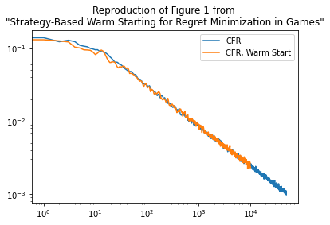
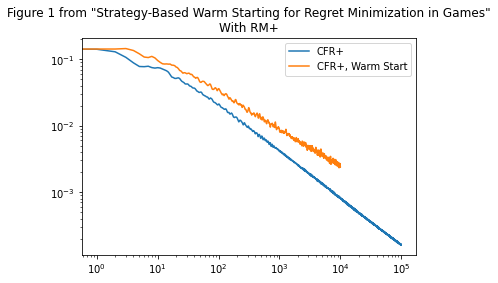

# Strategy-Based Warm Starting
Python replication of "Strategy-Based Warm Starting for Regret Minimization in Games", Noam Brown &amp; Tuomas Sandholm 2016

paper: https://www.cs.cmu.edu/~noamb/papers/16-AAAI-Strategy-Based-TR.pdf

# Result

Figure 1 from the paper (random 100x100 matrix games, warm-starting cumulative regrets each iteration from the average policy):



Also tried doing the same experiment as Figure 1, but with RM+. RM+ improves the results without warm-starting, but not with warm-starting? Maybe I did something wrong:



# Citation

```bibtex
@inproceedings{brown2016strategy,
  title={Strategy-based warm starting for regret minimization in games},
  author={Brown, Noam and Sandholm, Tuomas},
  booktitle={Proceedings of the AAAI Conference on Artificial Intelligence},
  volume={30},
  number={1},
  year={2016}
}
```